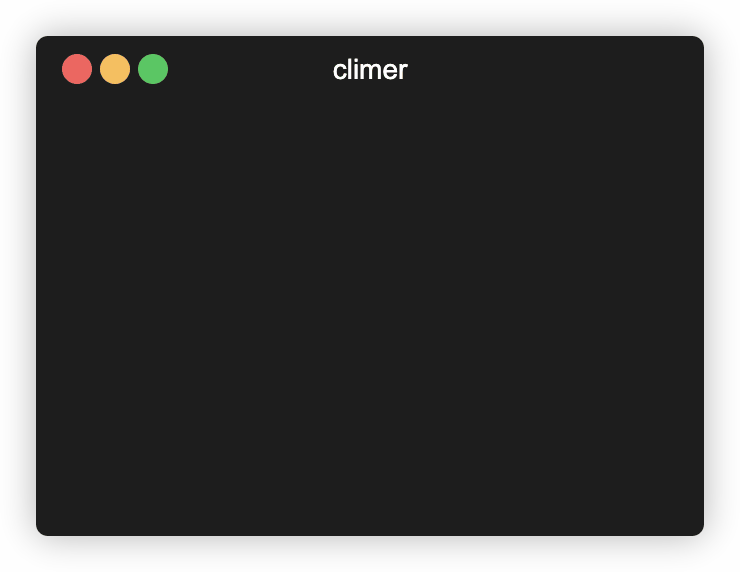

# climer

`climer` is a simple timer that runs from the command line.



# Installation

See the [release page](https://github.com/faustind/climer/releases) to get the
right artifact and put it in your path :)

# Usage

```
Usage of climer:

	climer -d duration

The flags are:

	-d
	    The duration of the timer as a string of unsigned
	    decimal numbers, each with optional fraction and
	    a unit suffix, such as "300ms", "1.5h" or "2h45m".
	    Expected time units are "s", "m", "h".
```
